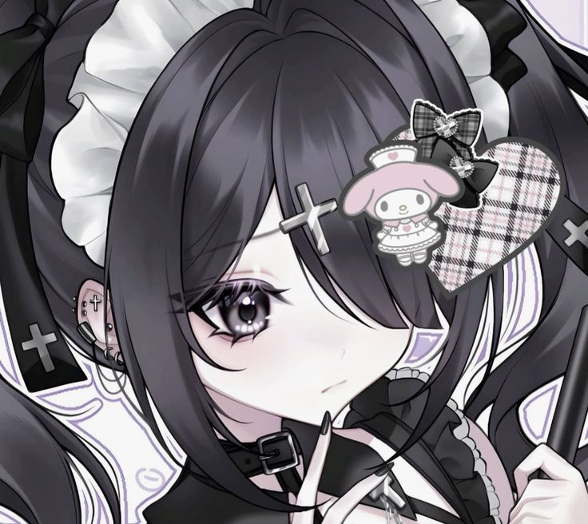
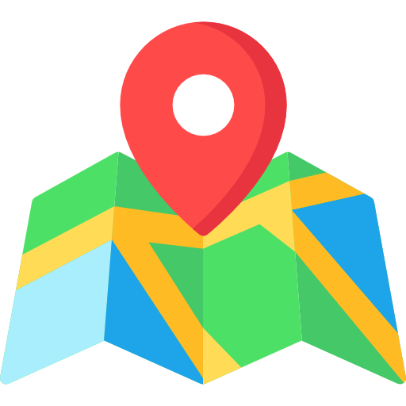

<table>
	<tr>
		<td width="340">
			
		</td>
		<td>
			<h1>Kagebyte works</h1>
			<p>
				 <b>青森市, Japan</b>
			</p>
		</td>
	</tr>
</table>

---

##  kagebyte://about

we are an independent software and interactive media group focused on:

- rhyrhm games
- visual systems
- reverse engineering and post-support
- arcade entertainment systems

---

##  kagebyte://stack

```txt
• C/C++
• Qt
• SDL2/SDL3
• Python
• Objective-C
• Kotlin
```

---

##  kagebyte://status

currently experimenting with:

* Telegram miniapps
* exteraPlugins SDK
* T*ITO tates RE & drop-in repl.
* <a href=https://github.com/kagebyte-inc/vectorail> Vectorail</a> 

---

<p align="center">
	<i>built somewhere between late-night commits and sleep deprivation.</i>
</p>
```
